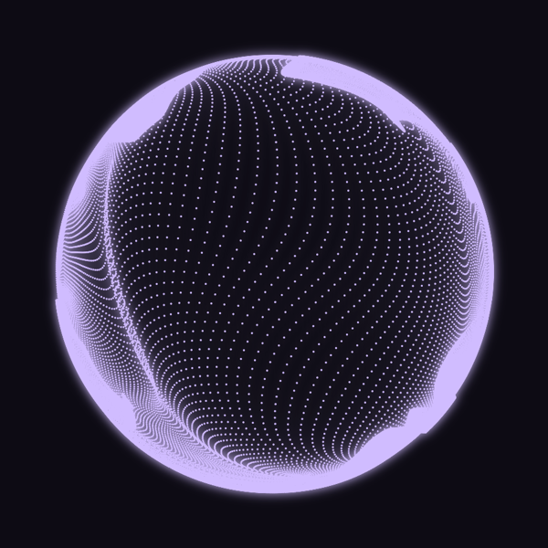
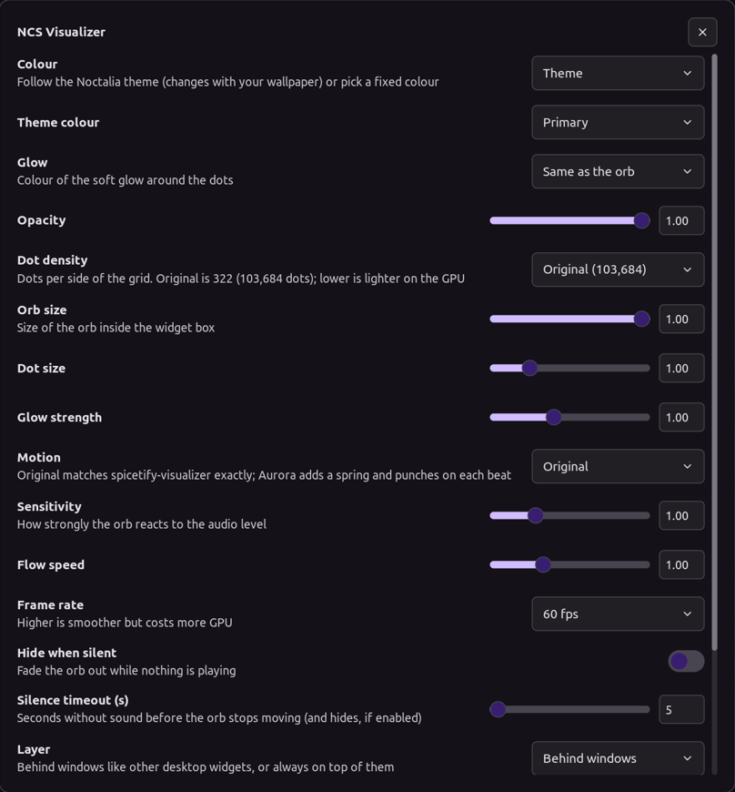
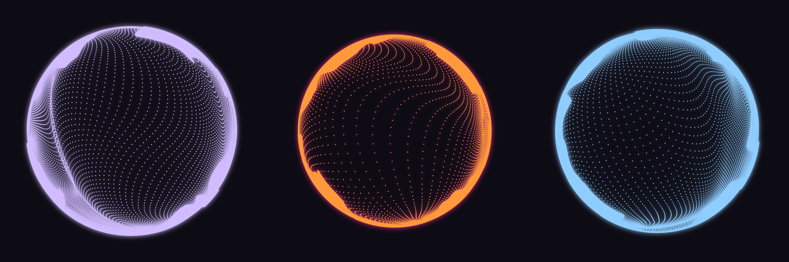

# NCS Visualizer for Noctalia

The NCS visualizer orb from [spicetify-visualizer][upstream] as a
[Noctalia](https://noctalia.dev) desktop widget. It is driven by whatever your
speakers are playing, and by default it takes its colour from your Noctalia theme.

All 322 × 322 = **103,684 dots** are drawn every frame on the GPU, with the
original shaders.



This is the Noctalia/Wayland sibling of the
[Plasma widget](https://github.com/BiparJoy/plasma-ncs-visualizer). It uses the
same renderer and the same motion model.

## How it is put together

| Part | Where | What it does |
| --- | --- | --- |
| **`aurora-ncs`** | [`renderer/`](renderer) | Small Qt 6 program. It runs the four-pass GPU pipeline from the Plasma widget unchanged, reads audio from CAVA, and draws each orb in its own click-through layer-shell surface. |
| **Plugin** `tausif/ncs-visualizer` | [`plugin/ncs-visualizer/`](plugin/ncs-visualizer) | Pure Luau. It provides the desktop widget you place and resize, the settings page, a Control Center tile and IPC, and it starts and feeds the renderer. |

Noctalia plugins can't draw custom GPU shaders or ship compiled code, so the
work is split. The plugin reads where each orb sits in the desktop-widget layout,
resolves colours and settings, and writes them to a JSON file. The renderer
follows that file live: moving, resizing or recolouring an orb applies within a
second. The renderer exits when the file disappears or the plugin's heartbeat
stops, so it never outlives Noctalia.

## Install

```sh
./install.sh          # builds aurora-ncs into ~/.local/bin, no sudo
```

Then in Noctalia:

1. Go to **Settings → Plugins** and install **NCS Visualizer**.
2. Open the **desktop widget editor** and add **NCS Visualizer**.
3. In that widget's settings, turn **Background off**.

Build dependencies are Qt 6 (base and declarative), LayerShellQt, CMake and a
C++17 compiler. At runtime you need **cava**, a wlr-layer-shell compositor
(niri, Hyprland, Sway, river, …) and OpenGL 3.3. `install.sh` lists the package
names for the common distros.

## Settings



| Setting | |
| --- | --- |
| Colour | Theme (primary / secondary / tertiary, follows the wallpaper) or custom |
| Glow | Same as the orb, a theme colour, or custom |
| Opacity, orb size, dot density, dot size, glow strength | Look |
| Motion | **Original** is upstream's 0.15 s moving average. **Aurora** adds a spring and punches on each beat. |
| Sensitivity, flow speed, beat punch | Response |
| Frame rate | 30 / 60 / 120 fps |
| Hide when silent, silence timeout | After the timeout it stops drawing, and fades out if hiding is on |
| Layer | Behind windows (default) or above them |
| Audio source, smoothing, renderer path | Advanced |



## Controls

- **Control Center tile:** click to show or hide the orb, right-click for settings.
- **IPC:** `noctalia msg plugin tausif/ncs-visualizer:service all toggle|on|off`

## Running the renderer by hand

```sh
aurora-ncs --config ~/.local/state/noctalia/plugins/data/tausif/ncs-visualizer/renderer.json
```

Every config key is optional except `instances`. See
[`renderer/src/driver.cpp`](renderer/src/driver.cpp) (`Driver::loadConfig`).

## Credits and licence

- Shaders and pipeline: [spicetify-visualizer][upstream] by Konsl.
- "Aurora" motion model: the Aurora player.
- Licence: GPL-3.0-or-later.

[upstream]: https://github.com/Konsl/spicetify-visualizer
